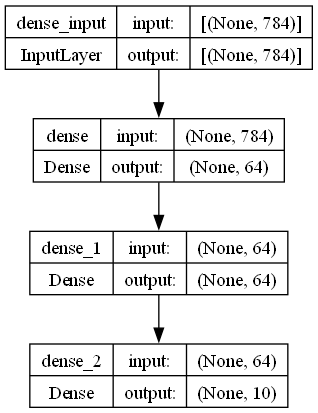

# TensorFlow Model Visualize

## Overview

A Python script to visualize TensorFlow neural network models as images.

## How to Use

1. Install TensorFlow and other dependencies.
2. Clone or download this repository.
3. Run the script with `python main.py`.
4. View the generated `model.png` image.

